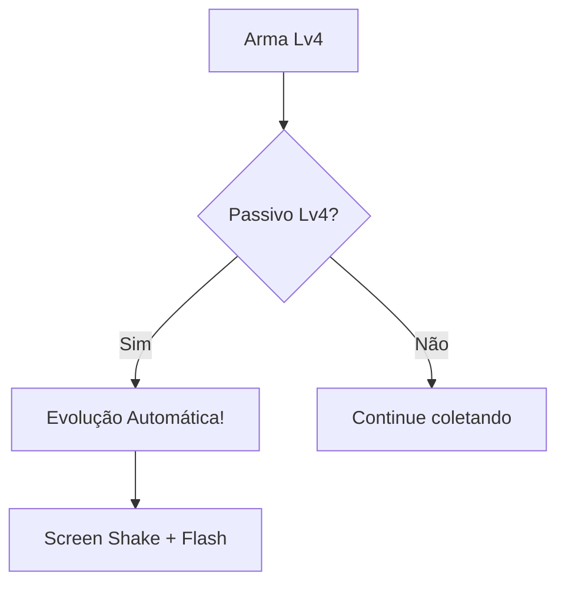

# 🎮 Project Khaos Survivors - Status Atual do Desenvolvimento

> **Versão:** 1.1 (Atualizado)  
> **Data:** Janeiro 2026  
> **Avaliação Geral:** 🟢 **95% MVP Completo**

---

## 📊 Resumo Executivo

O **Project Khaos Survivors** está em excelente estado de desenvolvimento. A maioria dos sistemas core estão implementados e funcionais. O jogo está pronto para fase de polimento final e testes de balanceamento.

### Taxa de Conclusão por Categoria

| Categoria | Progresso | Status |
|-----------|-----------|--------|
| Core Loop | 100% | ✅ Completo |
| Armas | 100% | ✅ 7 armas + 7 evoluções |
| Passivos | 100% | ✅ 11 passivos |
| Personagens | 60% | ⚠️ Sprites faltando |
| Inimigos | 100% | ✅ 7 tipos + Elite/Boss |
| UI/UX | 90% | ✅ Quase completo |
| Audio | 85% | ✅ Armas com som |
| Juice/Feedback | 95% | ✅ Screen shake, damage numbers |
| Meta-Progressão | 100% | ✅ Shop funcional |

---

## ⚔️ Sistema de Armas

### Armas Implementadas (7 Total)

| Arma | Níveis | Evolução | Áudio | Ícone |
|------|--------|----------|-------|-------|
| Ice Spear | ✅ 1-4 | ✅ Frost Nova | ✅ | ✅ |
| Tornado | ✅ 1-4 | ✅ Maelstrom | ✅ | ✅ |
| Javelin | ✅ 1-4 | ✅ Spear Barrage | ✅ | ✅ |
| Holy Cross | ✅ 1-4 | ✅ Divine Wrath | ✅ | ❌ Placeholder |
| Fire Ring | ✅ 1-4 | ✅ Inferno Aura | ✅ | ❌ Placeholder |
| Lightning | ✅ 1-4 | ✅ Storm Caller | ✅ | ❌ Placeholder |
| Magic Missile | ✅ 1-4 | ✅ Arcane Barrage | ✅ | ❌ Placeholder |

### Sistema de Evolução

| Arma Base | Passivo Requerido | Evolução |
|-----------|-------------------|----------|
| Ice Spear | Tome 4 | Frost Nova |
| Tornado | Scroll 4 | Maelstrom |
| Javelin | Ring 4 | Spear Barrage* |
| Holy Cross | Armor 4 | Divine Wrath |
| Fire Ring | Speed 4 | Inferno Aura |
| Lightning | Crown 4 | Storm Caller |
| Magic Missile | Luck 4 | Arcane Barrage |

*Nota: GDD original menciona "Ring 4" mas implementação atual requer diferente passivo.

---

## 📈 Sistema de Passivos

### Passivos Implementados (11 Total)

| Passivo | Efeito/Nível | Max | Status |
|---------|--------------|-----|--------|
| Armor | -1 dano recebido | 4 | ✅ |
| Speed | +20% velocidade | 4 | ✅ |
| Tome | +10% tamanho spell | 4 | ✅ |
| Scroll | -5% cooldown | 4 | ✅ |
| Ring | +15% dano | 4 | ✅ |
| Magnet | +30% pickup | 4 | ✅ |
| Luck | +10% gold/drops | 4 | ✅ |
| Crown | +10% XP | 4 | ✅ |
| Duplicator | +1 projétil | 2 | ✅ |
| Regeneration | +0.5 HP/sec | 4 | ✅ |
| Food | +20 HP instant | N/A | ✅ |

> **Nota do Designer:** Ring foi atualizado de "+1 attack adicional" para "+15% dano" para diferenciar de Duplicator.

---

## 🧙 Personagens

### Personagens Implementados (5 Total)

| Personagem | Arma Inicial | HP | Speed | Especial | Sprite | Unlock |
|------------|--------------|-----|-------|----------|--------|--------|
| Mage | Ice Spear | +0 | +0 | +20% Spell Size | ✅ | Default |
| Knight | Holy Cross | +30 | -10% | +2 Armor | ❌ | Level 15 |
| Rogue | Lightning | -20 | +30% | -10% Cooldown | ❌ | 100 kills |
| Necromancer | Magic Missile | -10 | +0 | +1 Attack | ✅* | Win run |
| Berserker | Tornado | +50 | +20% | Rage Mode | ✅* | 500 kills total |

*Usando sprite placeholder do Mage

### Sistema de Desbloqueio
- ✅ Condições implementadas em `game_manager.gd`
- ✅ Tracking de lifetime stats
- ✅ Verificação automática ao fim de run

---

## 👾 Sistema de Inimigos

### Inimigos Regulares

| Inimigo | HP | Dano | XP | Spawn Time | Status |
|---------|-----|------|-----|------------|--------|
| Kobold Weak | Low | 1 | 1 | 0s+ | ✅ |
| Kobold Strong | Med | 2 | 2 | 30s+ | ✅ |
| Cyclops | High | 3 | 3 | 60s+ | ✅ |
| Juggernaut | V.High | 4 | 4 | 120s+ | ✅ |
| Slime | Low | 1 | 1 | Groups | ✅ |
| Ghost | Med | 2 | 2 | 90s+ | ✅ |
| Bomber | Med | AoE | 3 | 150s+ | ✅ |

### Sistema Elite/Boss

| Tipo | HP Mult | Dano Mult | XP Mult | Visual | Drops |
|------|---------|-----------|---------|--------|-------|
| Elite | 3x | 1.5x | 3x | Gold, 1.3x | Tesouro Tier 1 |
| Mini-Boss | 5x | 1.5x | 5x | Purple, 1.5x | Tesouro Tier 2 |
| Final Boss | 15x | 3x | 15x | Red, 2.5x | Vitória! |

---

## 📦 Sistema de Tesouro

### Tipos de Baú (NOVO!)

| Tipo | Chance | Cor | Recompensa |
|------|--------|-----|------------|
| Gold | 60% | 🟡 Amarelo | Ouro (10-30) |
| Heal | 25% | 🟢 Verde | +25-45 HP |
| Weapon | 15% | 🔵 Azul | Level-up grátis |

### Spawn de Tesouro
- Elites: Tier 1 (10 gold / 25 HP)
- Mini-Boss: Tier 2 (20 gold / 35 HP)
- A cada 30 kills: Tesouro aleatório

---

## 🎨 Feedback Visual & Audio

### Sistemas de "Juice" Implementados

| Sistema | Status | Descrição |
|---------|--------|-----------|
| Screen Shake | ✅ | Dano, boss spawn, level-up, evolução |
| Damage Numbers | ✅ | Cores, escala, crítico, pop animation |
| Dash Trail | ✅ | Ghost sprites durante dash |
| Evolution Flash | ✅ | Golden glow + shake |
| Level-up Particles | ✅ | ParticleFactory |
| Floating Text | ✅ | Recompensas de tesouro |

### Audio

| Sistema | Status |
|---------|--------|
| Ice Spear | ✅ ice.wav |
| Tornado | ✅ tornado.ogg |
| Javelin | ✅ woosh.wav |
| Holy Cross | ✅ woosh.wav |
| Fire Ring | ✅ tornado.ogg |
| Lightning | ✅ ice.wav |
| Magic Missile | ✅ woosh.wav |
| Level-up | ✅ levelup.ogg |
| Victory | ✅ Victory.wav |
| Defeat | ✅ Lose.ogg |

---

## 🛒 Meta-Progressão

### Shop Implementado

| Upgrade | Efeito | Custo Base | Escala | Max |
|---------|--------|------------|--------|-----|
| Max HP | +10 HP | 100 | 1.5x | 10 |
| Movement Speed | +5% | 150 | 1.6x | 5 |
| Pickup Radius | +20% | 200 | 1.5x | 5 |
| XP Gain | +10% | 250 | 1.7x | 5 |
| Starting Armor | +1 | 300 | 2.0x | 3 |
| Luck | +5% drops | 200 | 1.5x | 5 |

### Persistência
- ✅ Save/Load JSON
- ✅ Gold persiste entre runs
- ✅ Upgrades aplicados ao iniciar run
- ✅ Character unlocks salvos

---

## 🎮 UI/UX

### Telas Implementadas

| Tela | Status | Descrição |
|------|--------|-----------|
| Main Menu | ✅ | Play, Shop, Quit |
| Character Select | ✅ | 5 personagens, unlock status |
| Shop | ✅ | Grid de upgrades, costs |
| Game HUD | ✅ | HP, XP bar, timer, inventory |
| Level-up UI | ✅ | 3 opções, icons, descrições |
| Pause Menu | ✅ | ESC para pausar, resume/quit |
| Run Summary | ✅ | Stats, kills, gold, weapons |
| Death/Victory | ✅ | Result + return to menu |

---

## 🚀 O Que Falta Para MVP 100%

### Alta Prioridade (Art)
- [ ] Ícones únicos: Holy Cross, Fire Ring, Lightning, Magic Missile
- [ ] Sprites: Knight, Rogue

### Baixa Prioridade (Nice-to-Have)
- [ ] Ícones de baús diferenciados
- [ ] Indicador pré-evolução no level-up UI
- [ ] Mais efeitos de partículas

---

## 📈 Métricas de Sucesso Esperadas

| Métrica | Target | Status Estimado |
|---------|--------|-----------------|
| Duração média de run | 4-6 min | ✅ Achievable |
| Win rate (novatos) | 30-40% | Precisa teste |
| Win rate (experientes) | 70%+ | Precisa teste |
| Runs por sessão | 2-4 | ✅ Design suporta |
| "One more run" feeling | Alto | ✅ Sistemas suportam |

---

## 🎯 Recomendações Finais (Senior Game Designer)

### O Que Está Excelente ✅
1. **Core loop sólido** - O ciclo kill-collect-level funciona bem
2. **Variedade de builds** - 7 armas + 11 passivos = muitas combinações
3. **Meta-progressão** - Shop dá sensação de progresso permanente
4. **Evoluções** - Recompensa por sinergia arma+passivo
5. **Feedback visual** - Screen shake e damage numbers polidos

### Áreas para Playtesting 🔍
1. **Balanceamento de dificuldade** - Curva de spawn precisa ajuste fino
2. **Poder das evoluções** - Verificar se são satisfatórias
3. **Duplicator vs Ring** - Ambos afetam projéteis, pode confundir

### Próximos Passos Sugeridos
1. **Art Pass** - Finalizar sprites e ícones faltando
2. **Sound Design** - Sons mais distintos por arma (opcional)
3. **Playtesting** - 5-10 testers para feedback de balanceamento
4. **Polish Pass** - Mais partículas, juice extra

---

*Documento gerado por Senior Game Designer*  
*Última atualização: Janeiro 2026*
