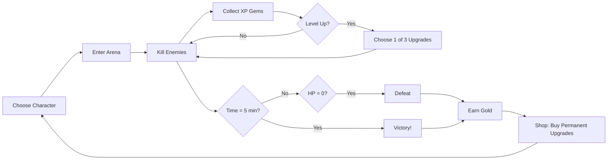

# 🎮 Project Khaos Survivors - Game Design Document

> **Version:** 1.0  
> **Engine:** Godot 4.4  
> **Genre:** Bullet Heaven / Survivors-like Action Roguelite  
> **Target Platform:** PC (Mobile-ready viewport)

---

## 📖 Executive Summary

**Project Khaos Survivors** is a time-based survival game inspired by *Vampire Survivors* and *Brotato*. Players control a hero who automatically attacks waves of enemies while collecting experience gems to level up and choose powerful upgrades. The goal is to survive for 5 minutes (300 seconds), defeating increasingly difficult enemies and bosses along the way.

### Core Fantasy
*"Become an unstoppable magical force, mowing through hordes of monsters with an arsenal of devastating spells."*

### Current State Assessment
The game has a **solid foundation** with core systems implemented:
- ✅ Player movement and combat
- ✅ 6 weapon types with 4 levels each
- ✅ 11 passive upgrades
- ✅ 3 playable characters
- ✅ Enemy spawning with elites/bosses
- ✅ Meta-progression shop
- ✅ Weapon evolution system (framework)
- ⚠️ Visual polish needed
- ⚠️ Balance tuning required
- ⚠️ Missing "juice" and feedback

---

## 🎯 Design Pillars

### 1. **Satisfying Power Fantasy**
Every level-up should feel impactful. Watch weapons grow from single projectiles into screen-clearing devastation.

### 2. **"One More Run" Addiction**
Short sessions (5-10 min), meaningful meta-progression, and enough variety to make each run feel fresh.

### 3. **Build Diversity**
Multiple viable strategies: stack one weapon, spread across many, focus on passives, or go all-in on cooldown reduction.

### 4. **Escalating Chaos**
Start manageable, end with screen-filled enemies and equally absurd player power.

---

## 🕹️ Core Gameplay Loop



### Session Length
- **Target:** 5-10 minutes per run
- **Win Condition:** Survive 300 seconds (5 minutes)
- **Fail State:** HP reaches 0

---

## 🧙 Characters

| Character | Starting Weapon | HP Bonus | Speed Bonus | Special |
|-----------|-----------------|----------|-------------|---------|
| **Mage** | Ice Spear | +0 | +0 | +20% Spell Size |
| **Knight** | Holy Cross | +30 | -10% | Tanky, close-range |
| **Rogue** | Lightning | -20 | +30% | -10% Cooldowns |

### Character Design Notes
- Each character should encourage a **different playstyle**
- Knight wants defensive passives + healing
- Rogue wants cooldown reduction + speed
- Mage wants spell size + additional attacks

---

## ⚔️ Weapons System

### Current Weapons (6 Total)

| Weapon | Behavior | Synergy Passive |
|--------|----------|-----------------|
| **Ice Spear** | Projectile at random enemy | Tome (Size) |
| **Tornado** | Travels in movement direction | Scroll (Cooldown) |
| **Javelin** | Orbiting weapon, attacks in lines | Ring (Extra attacks) |
| **Holy Cross** | Boomerang projectile | - |
| **Fire Ring** | Orbits player, damages nearby | - |
| **Lightning** | Chains between enemies | - |

### Weapon Level Scaling

| Level | Typical Improvement |
|-------|---------------------|
| 1 | Base weapon acquired |
| 2 | +1 projectile OR +damage |
| 3 | +pierce OR -cooldown |
| 4 | Major power spike (+2 proj, evolution eligible) |

### Weapon Evolutions
Evolutions require: **Weapon Lv4 + Paired Passive Lv4**

| Base Weapon | Required Passive | Evolution | Effect |
|-------------|------------------|-----------|--------|
| Ice Spear | Tome 4 | Frost Nova | AoE explosion on hit |
| Tornado | Scroll 4 | Maelstrom | Larger, more damage, pulls enemies |
| Javelin | Ring 4 | Spear Barrage | Rapid-fire javelins |
| Holy Cross | - | *TBD* | - |
| Fire Ring | - | *TBD* | - |
| Lightning | - | *TBD* | - |

---

## 📈 Passive Upgrades

### Current Passives (11 Total)

| Passive | Effect per Level | Max Level |
|---------|------------------|-----------|
| **Armor** | -1 damage taken | 4 |
| **Speed** | +50% movement | 4 |
| **Tome** | +10% spell size | 4 |
| **Scroll** | -5% cooldown | 4 |
| **Ring** | +1 additional attack | 4 |
| **Magnet** | +30% pickup radius | 4 |
| **Luck** | +10% gold/drops | 4 |
| **Crown** | +10% XP gain | 4 |
| **Duplicator** | +1 projectile (all weapons) | 2 |
| **Regeneration** | +0.5 HP/sec | 4 |
| **Food** | Heal 20 HP (instant) | N/A |

### Passive Balance Notes
- **Duplicator** is currently extremely powerful (stacks with Ring)
- **Speed** may need diminishing returns at high levels
- **Magnet** quality-of-life but not exciting

---

## 👾 Enemies

### Regular Enemies

| Enemy | HP | Speed | Damage | XP | Spawn Time |
|-------|-----|-------|--------|-----|------------|
| Kobold Weak | Low | Medium | 1 | 1 | 0s+ |
| Kobold Strong | Medium | Medium | 2 | 2 | 30s+ |
| Cyclops | High | Slow | 3 | 3 | 60s+ |
| Juggernaut | Very High | Very Slow | 4 | 4 | 120s+ |

### Elite Enemies
- Spawn every **60 seconds**
- **3x HP**, **3x XP**, **1.5x Damage**
- Gold tint, 1.3x scale
- **Drop treasure chest on death**

### Bosses
- Spawn every **300 seconds** (5 minutes)
- **10x HP**, **10x XP**, **2x Damage**
- Red tint, 2x scale
- **Drop 3x treasure on death**

---

## 💰 Economy & Progression

### In-Run Economy
| Source | Gold Amount |
|--------|-------------|
| Regular Treasure | 10 |
| Elite Kill | 10 |
| Boss Kill | 30 |
| Kills threshold (30) | Treasure spawn |

### Meta-Progression Shop

| Upgrade | Effect/Level | Base Cost | Scale | Max |
|---------|--------------|-----------|-------|-----|
| Max HP | +10 HP | 100 | 1.5x | 10 |
| Movement Speed | +5% | 150 | 1.6x | 5 |
| Pickup Radius | +20% | 200 | 1.5x | 5 |
| XP Gain | +10% | 250 | 1.7x | 5 |
| Starting Armor | +1 | 300 | 2.0x | 3 |
| Luck | +5% drops | 200 | 1.5x | 5 |

---

## 🎨 Visual & Audio Design

### Current Style
- **Art:** 16x16 pixel art
- **Resolution:** 640x360 (scales to 1280x720)
- **Camera:** Follows player smoothly

### Identified Improvements Needed
- [ ] Damage numbers lack punch
- [ ] No screen shake on big hits
- [ ] Missing hit stop/pause frames
- [ ] Weapon audio missing for most attacks
- [ ] No visual telegraph for enemy attacks
- [ ] Minimal particle effects

---

## 🔧 Technical Architecture

### Autoloads
- `GameManager` - Run state, stats, save/load
- `UpgradeDb` - All upgrade definitions

### Key Scripts
| Script | Purpose |
|--------|---------|
| `player.gd` | Movement, attacks, upgrades, leveling |
| `enemy.gd` | Base enemy AI (chase player) |
| `enemy_spawner.gd` | Wave management, elite/boss spawning |
| `upgrade_db.gd` | Upgrade definitions, evolution logic |

### Scene Structure
```
Main Menu
├── Character Select
├── Shop
└── World
    ├── Player (with attacks as children)
    ├── Enemy Spawner
    ├── Loot Container
    └── HUD
```

---

## 🚀 Improvement Roadmap

### 🔴 Priority 1: Critical (Do First)

| Feature | Impact | Effort | Notes |
|---------|--------|--------|-------|
| **Balance Pass** | High | Low | Enemies too tanky late-game |
| **Damage Numbers Polish** | High | Low | Add scaling, colors, crit indicators |
| **Screen Shake** | High | Low | On player hit, on big kills |
| **Hit Stop** | High | Low | Brief freeze on critical hits |
| **Audio for All Weapons** | High | Medium | Currently mostly silent |

### 🟡 Priority 2: Important

| Feature | Impact | Effort | Notes |
|---------|--------|--------|-------|
| **Complete Evolutions** | High | Medium | Holy Cross, Fire Ring, Lightning need evolutions |
| **Treasure Chest Variety** | Medium | Low | Different chest types (heal, weapon, etc.) |
| **Pause Menu** | High | Low | Currently no way to pause |
| **Run Summary Screen** | Medium | Medium | Show stats, upgrades, gold at end |
| **Character Sprites** | High | Medium | Knight and Rogue need proper sprites |

### 🟢 Priority 3: Polish

| Feature | Impact | Effort | Notes |
|---------|--------|--------|-------|
| **More Enemies** | Medium | Medium | 3-4 more distinct enemy types |
| **Visual Effects** | High | High | Particles, trails, explosions |
| **Music System** | High | Medium | Dynamic music, boss themes |
| **Unlockable Characters** | Medium | Medium | Achievement-based unlocks |
| **Daily Challenges** | Medium | High | Special modifiers, leaderboards |

### 🔵 Priority 4: Future Features

| Feature | Impact | Effort | Notes |
|---------|--------|--------|-------|
| **Maps/Stages** | High | High | Different biomes with unique enemies |
| **Synergy System** | High | High | Weapon combos create new effects |
| **Arcana System** | Medium | High | Major run modifiers (like VS) |
| **Achievement System** | Medium | Medium | Unlock progression |
| **Endless Mode** | Medium | Low | No time limit, survive as long as possible |

---

## ⚖️ Balance Parameters

### Time-Based Difficulty Curve

| Time | Enemy Spawn Rate | Enemy HP Mult | Max Concurrent |
|------|------------------|---------------|----------------|
| 0-30s | Slow | 1.0x | 10 |
| 30-60s | Medium | 1.0x | 20 |
| 60-120s | Fast | 1.2x | 30 |
| 120-180s | Very Fast | 1.5x | 50 |
| 180-240s | Intense | 2.0x | 75 |
| 240-300s | Maximum | 2.5x | 100 |

### Player Power Curve (Expected)

| Time | Player Level | Weapons | Notes |
|------|--------------|---------|-------|
| 0-30s | 1-2 | 1 Lv1 | Learning enemies |
| 30-60s | 3-5 | 1-2 | Getting first passives |
| 60-120s | 6-10 | 2-3 | Weapon combos forming |
| 120-180s | 11-15 | 3-4 | Feeling powerful |
| 180-240s | 16-20 | 4-5 | Peak power |
| 240-300s | 20+ | 5-6 | God mode vs final wave |

---

## 🎮 Controls

| Input | Action |
|-------|--------|
| WASD | Movement |
| - | Attacks are automatic |
| ESC | Pause (TBD) |

---

## 📊 Success Metrics

### Engagement Targets
- Average run length: 4-6 minutes
- Win rate: 30-40% for new players, 70%+ for experienced
- Runs per session: 2-4
- Meta progression purchases per run: 1-2

### Fun Indicators
- "Just one more run" feeling
- Desire to try different build paths
- Excitement at level-up choices
- Satisfaction at evolved weapons

---

## 📝 Known Issues & Bugs

1. **Missing Knight/Rogue Sprites** - Using placeholder or missing textures
2. **Pause Not Implemented** - Game cannot be paused mid-run
3. **Evolution UI Missing** - No visual feedback when evolution available
4. **Some Weapons Silent** - Holy Cross, Fire Ring, Lightning lack audio
5. **Level-up formula bug** - Line 348 in player.gd has `exp_cap +` instead of `exp_cap =`

---

## 🎯 Next Sprint Goals

### Sprint 1: "Feel Good" Update
1. Fix level-up XP formula bug
2. Add screen shake on player damage
3. Add hit stop on critical kills
4. Polish damage numbers (scale, colors)
5. Add pause menu

### Sprint 2: "Complete the Arsenal" Update
1. Add Holy Cross evolution
2. Add Fire Ring evolution  
3. Add Lightning evolution
4. Add proper weapon sound effects
5. Implement run summary screen

### Sprint 3: "More Chaos" Update
1. Add 2-3 new enemy types
2. Add 2-3 new weapons
3. Add particle effects for all weapons
4. Balance pass on all weapons and enemies

---

*Document created by Senior Game Designer analysis*  
*Last updated: December 2024*
